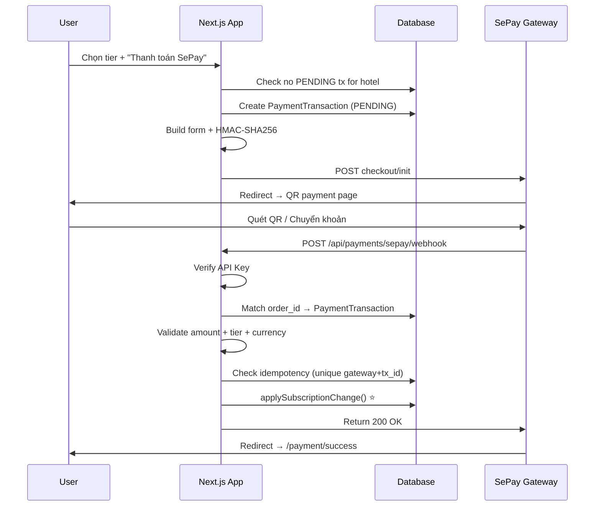

# Phase 02: SePay Checkout Integration (VND)
Status: ⬜ Pending
Dependencies: Phase 01
Updated: 2026-02-15 (P0 + P1 review applied)

## Objective
Tạo flow thanh toán VND qua SePay: tạo checkout → redirect → webhook → kích hoạt gói.

## Implementation Steps

### 2.1. API Route: Create Checkout
- [ ] `app/api/payments/sepay/create-checkout/route.ts`
- [ ] Auth: require session
- [ ] Nhận `{ tier, roomBand, hotelId }` từ client
- [ ] **Wrap trong Prisma `$transaction()`** (P1 atomicity)
- [ ] **Concurrent lock**: trong transaction, query PENDING cho hotel **FOR UPDATE** (hoặc `$transaction` isolation level `Serializable`). Reject nếu đã có PENDING chưa expire
- [ ] Lookup pricing từ `constants.ts` → lấy VND price
- [ ] Tạo unique `order_id`: `RMS-{hotelId.slice(0,8)}-{Date.now()}`
- [ ] Build form data + HMAC-SHA256 signature (via `sepay.ts`)
- [ ] Tạo `PaymentTransaction` record:
  - `status: PENDING`
  - `order_id: unique`
  - `purchased_tier + purchased_room_band` snapshot
  - `hotel_id + user_id`
  - `currency: 'VND'`
  - `expires_at: now + 30min` (P1)
- [ ] Return checkout URL / form data cho client redirect

### 2.2. API Route: SePay Webhook
- [ ] `app/api/payments/sepay/webhook/route.ts`
- [ ] **Security**: verify API Key header (`SEPAY_WEBHOOK_API_KEY`)
- [ ] Parse webhook payload (typed via `parseSepayWebhook()`)
- [ ] **Match**: ưu tiên match `code` field → `PaymentTransaction.order_id`
- [ ] **Validate 3 điều kiện** (P0 critical):
  1. `transferAmount === PaymentTransaction.amount`
  2. `currency === 'VND'`
  3. Amount khớp đúng với `purchased_tier × purchased_room_band` price
- [ ] **Idempotency**: check `@@unique([gateway, gateway_transaction_id])` — nếu đã tồn tại → skip, return 200
- [ ] If validated — **wrap in Prisma `$transaction()`** (P1 atomicity):
  - Update `PaymentTransaction.status = COMPLETED`, `completed_at = now`, save `raw_payload`
  - Call `applySubscriptionChange(hotelId, { periodStart: now, periodEnd: now + 30d, provider: 'SEPAY', plan })` ⭐
  - Both updates in SAME transaction
  - Log `AuditLog`
- [ ] If amount mismatch:
  - Update `PaymentTransaction.status = FAILED`, `failed_at = now`, `failed_reason = 'amount_mismatch'`
  - Log warning for manual reconciliation

### 2.3. Return/Cancel Pages
- [ ] `app/payment/success/page.tsx` — Thank you page, show new tier
- [ ] `app/payment/cancel/page.tsx` — Payment cancelled, try again

## Flow

## Files to Create
| File | Action |
|------|--------|
| `app/api/payments/sepay/create-checkout/route.ts` | NEW |
| `app/api/payments/sepay/webhook/route.ts` | NEW |
| `app/payment/success/page.tsx` | NEW |
| `app/payment/cancel/page.tsx` | NEW |

## Test Criteria
- [ ] Checkout form generates valid HMAC-SHA256
- [ ] Webhook correctly matches order_id
- [ ] Amount + tier validation catches mismatches
- [ ] Duplicate webhook calls return 200 without double-activate
- [ ] PENDING lock prevents concurrent payment attempts
- [ ] `applySubscriptionChange()` correctly updates subscription
