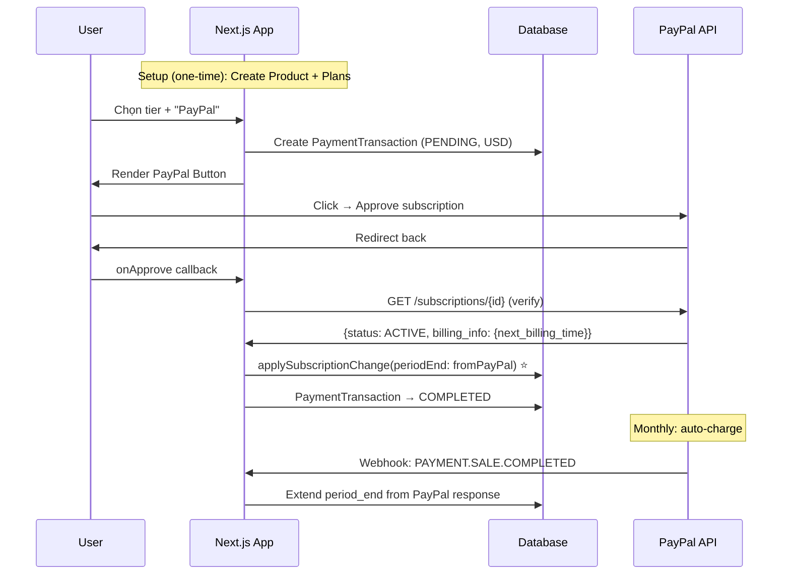

# Phase 03: PayPal Subscription Integration (USD)
Status: ⬜ Pending
Dependencies: Phase 01
Updated: 2026-02-15 (P0 + P1 review applied)

## Objective
Tạo flow subscription USD qua PayPal: create plan → subscribe → webhook → kích hoạt, với auto-renew hàng tháng.

## Implementation Steps

### 3.1. One-time Setup: Products & Plans
- [ ] Script `scripts/setup-paypal-plans.ts`:
  - Create Product: "4TK Hospitality RMS"
  - Create Plans per tier × roomBand (monthly, USD pricing)
  - Store Plan IDs trong `constants.ts` hoặc env vars
- [ ] Plans cần set `auto_billing`: PayPal sẽ tự động charge recurring monthly

### 3.2. Client: PayPal Button Component
- [ ] `components/payments/PayPalCheckout.tsx`
- [ ] Wrap in `PayPalScriptProvider` with `NEXT_PUBLIC_PAYPAL_CLIENT_ID`
- [ ] `PayPalButtons` with `createSubscription` + `onApprove`
- [ ] On `createSubscription`:
  - Gọi backend để tạo `PaymentTransaction` (PENDING) với `order_id` unique
  - Return `plan_id` cho PayPal SDK
- [ ] On `onApprove`:
  - POST `/api/payments/paypal/activate` với `subscriptionId`

### 3.3. API Route: Activate Subscription
- [ ] `app/api/payments/paypal/activate/route.ts`
- [ ] **Verify** subscription status trực tiếp từ PayPal API (KHÔNG tin client)
- [ ] Call `getSubscriptionDetails(subId)` → check `status === 'ACTIVE'`
- [ ] **Extract period_end FROM PayPal response** (KHÔNG hard-code +30d):
  ```typescript
  const paypalSub = await getSubscriptionDetails(subId);
  const periodEnd = new Date(paypalSub.billing_info.next_billing_time);
  ```
- [ ] **Wrap in Prisma `$transaction()`** (P1 atomicity):
  - Call `applySubscriptionChange(hotelId, { periodStart: now, periodEnd: fromPayPal, provider: 'PAYPAL', externalSubId: subId, plan })` ⭐
  - Update `PaymentTransaction` → `status: COMPLETED`, `completed_at: now`
  - Store `provider_customer_ref = paypalSub.subscriber.email_address` (P1)
  - Both in SAME transaction

### 3.4. API Route: PayPal Webhook
- [ ] `app/api/payments/paypal/webhook/route.ts`
- [ ] **Verify webhook signature** via PayPal API (`verifyWebhookSignature()`)
- [ ] **Idempotency**: check unique `(gateway: PAYPAL, gateway_transaction_id: event.id)`, store `gateway_event_id = event.id` (P1)
- [ ] **P1: Re-fetch subscription details** from PayPal API for billing_info (don't trust webhook payload alone)
- [ ] Handle events:

| Event | Action |
|-------|--------|
| `BILLING.SUBSCRIPTION.ACTIVATED` | `applySubscriptionChange()` — activate tier |
| `BILLING.SUBSCRIPTION.CANCELLED` | `applySubscriptionChange()` — downgrade STANDARD |
| `BILLING.SUBSCRIPTION.SUSPENDED` | Set `status = PAST_DUE` |
| `PAYMENT.SALE.COMPLETED` | Extend `period_end` FROM PayPal response, log transaction |
| `BILLING.SUBSCRIPTION.EXPIRED` | Downgrade to STANDARD |

- [ ] **Period end**: ALWAYS from PayPal API re-fetch `billing_info.next_billing_time`, **NEVER from webhook payload directly, NEVER hardcode +30d**
- [ ] **Wrap each event handler in Prisma `$transaction()`** (P1 atomicity)

## Flow


## Files to Create
| File | Action |
|------|--------|
| `components/payments/PayPalCheckout.tsx` | NEW |
| `app/api/payments/paypal/activate/route.ts` | NEW |
| `app/api/payments/paypal/webhook/route.ts` | NEW |
| `scripts/setup-paypal-plans.ts` | NEW |

## Test Criteria
- [ ] PayPal button renders in sandbox
- [ ] Subscription creates with correct plan_id
- [ ] `period_end` comes from PayPal response (not hardcoded)
- [ ] Webhook signature verification works
- [ ] Duplicate webhook events → idempotent (no double-activate)
- [ ] `PAYMENT.SALE.COMPLETED` extends period correctly
- [ ] `CANCELLED` event downgrades to STANDARD
