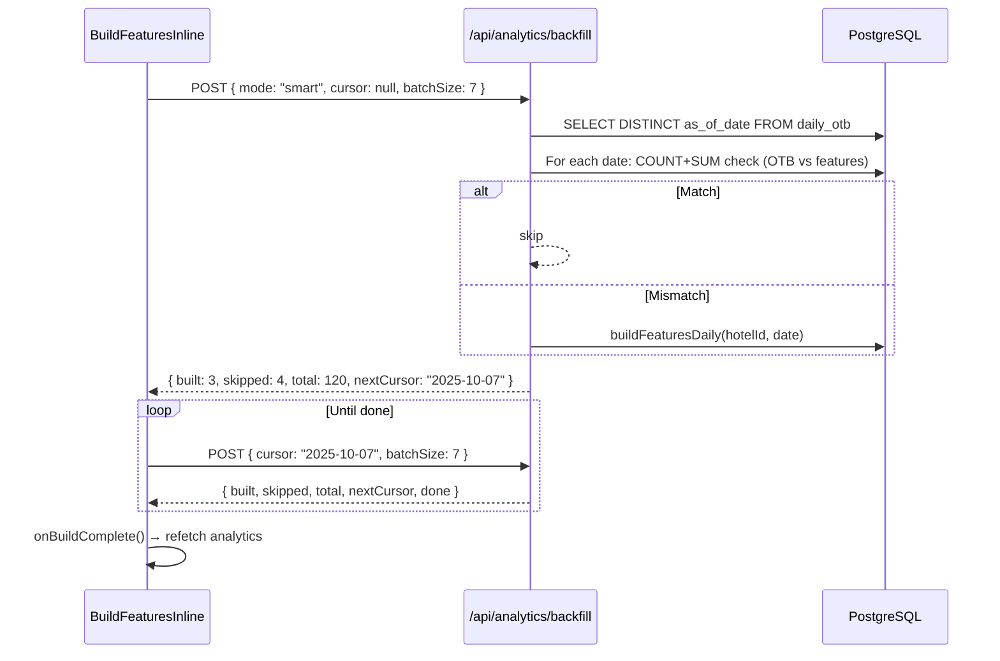

# Technical Specification
# 4TK Hospitality — Revenue Management System
# Module: Analytics Layer

**Version:** 2.0 | **Updated:** 2026-02-14

---

## 1. Tech Stack

| Layer | Technology |
|-------|-----------|
| Framework | Next.js 15 (App Router) |
| Language | TypeScript 5.x |
| Database | PostgreSQL (Neon Serverless) |
| ORM | Prisma 5.x |
| UI | React 19 + Lucide Icons |
| Hosting | Vercel |
| Auth | NextAuth.js (Google OAuth) |

## 2. File Map

### Server Actions
| File | Functions |
|------|-----------|
| `app/actions/buildDailyOTB.ts` | `buildDailyOTB()`, `rebuildAllOTB()`, `backfillOTB()`, `backfillMonthlySnapshots()` |
| `app/actions/buildFeaturesDaily.ts` | `buildFeaturesDaily()`, `validateOTBData()` |

### API Routes  
| File | Endpoint |
|------|----------|
| `app/api/analytics/features/route.ts` | `GET /api/analytics/features` |
| `app/api/analytics/backfill/route.ts` | `POST /api/analytics/backfill` |

### Components
| File | Component |
|------|-----------|
| `components/analytics/AnalyticsTabContent.tsx` | Main analytics container |
| `components/analytics/BuildFeaturesInline.tsx` | Inline build banner |
| `components/analytics/AnalyticsKpiRow.tsx` | KPI strip (Occ, Pace, Pickup, ADR) |
| `components/analytics/PaceTable.tsx` | Detailed pace/pickup table |
| `components/analytics/StlyComparisonChart.tsx` | STLY bar chart |
| `components/analytics/SupplyChart.tsx` | Remaining supply bar chart |
| `components/analytics/DatesToWatchPanel.tsx` | Alert dates horizontal strip |
| `components/analytics/types.ts` | Shared types + helpers |

## 3. Database Schema (Analytics Tables)

### `daily_otb`
```sql
CREATE TABLE daily_otb (
  hotel_id    UUID REFERENCES hotel(hotel_id),
  as_of_date  DATE NOT NULL,
  stay_date   DATE NOT NULL,
  rooms_otb   INTEGER NOT NULL DEFAULT 0,
  revenue_otb DECIMAL(15,2) NOT NULL DEFAULT 0,
  PRIMARY KEY (hotel_id, as_of_date, stay_date)
);
CREATE INDEX idx_daily_otb_hotel_asof ON daily_otb(hotel_id, as_of_date);
```

### `features_daily`
```sql
CREATE TABLE features_daily (
  hotel_id         UUID REFERENCES hotel(hotel_id),
  as_of_date       DATE NOT NULL,
  stay_date        DATE NOT NULL,
  dow              INTEGER,
  is_weekend       BOOLEAN,
  month            INTEGER,
  revenue_otb      DECIMAL(15,2),
  stly_revenue_otb DECIMAL(15,2),
  pickup_t30       INTEGER,
  pickup_t15       INTEGER,
  pickup_t7        INTEGER,
  pickup_t5        INTEGER,
  pickup_t3        INTEGER,
  pace_vs_ly       INTEGER,
  remaining_supply INTEGER,
  stly_is_approx   BOOLEAN DEFAULT FALSE,
  PRIMARY KEY (hotel_id, as_of_date, stay_date)
);
```

## 4. OTB Snapshot Policy Implementation

```typescript
// In rebuildAllOTB() — app/actions/buildDailyOTB.ts

// 1. Query existing snapshot dates (for dedup)
const existingSet = new Set(existingDates.map(d => d.toISOString().slice(0,10)));

// 2. Generate dates per tier
const monthlyDates = generate_series(minBookingDate, latest - 450d, '1 month');  // EOM
const weeklyDates  = generate_series(latest - 450d, latest - 35d, '7 days');
const dailyDates   = generate_series(latest - 35d, latest, '1 day');

// 3. Merge + dedup + build
const allDates = union(monthly, weekly, daily).filter(d => !existingSet.has(d));
for (const d of allDates) await buildDailyOTB({ hotelId, asOfTs: d });
```

### Volume Estimate (per hotel)
| Tier | Count | × stay_dates | Rows |
|------|-------|-------------|------|
| Daily 35d | ~35 | × 365 | ~12,750 |
| Weekly 450d | ~64 | × 365 | ~23,360 |
| Monthly | ~12-24 | × 365 | ~4,380-8,760 |
| **Total** | | | **~40K-45K** |

## 5. Backfill API Flow



## 6. Caching Strategy

| Layer | TTL | Key | Invalidation |
|-------|-----|-----|-------------|
| API in-memory | 10 min | `hotel:asOf:mode` | Timestamp expiry |
| Browser | 10 min | `Cache-Control: private, max-age=600` | Auto |
| Skip cache for | | Fallback (OTB-only) responses | Never cached |

## 7. Pickup Nearest-Neighbor Windows

| Target | Search Window | Scale Formula |
|--------|--------------|---------------|
| T-30 | `[D-35, D-25]` | `(curr - ref) / deltaDays × 30` |
| T-15 | `[D-19, D-11]` | `(curr - ref) / deltaDays × 15` |
| T-7 | `[D-10, D-4]` | `(curr - ref) / deltaDays × 7` |
| T-5 | `[D-7, D-3]` | `(curr - ref) / deltaDays × 5` |
| T-3 | `[D-4, D-2]` | `(curr - ref) / deltaDays × 3` |

**SQL:** `LEFT JOIN LATERAL ... ORDER BY (exact match DESC), ABS(distance ASC) LIMIT 1`

## 8. Error Recovery

| Failure | Recovery |
|---------|----------|
| Build fails for 1 date | Skip, increment `skipped`, continue batch |
| Browser closes mid-batch | Server finishes current batch call, cursor saved client-side |
| Concurrent builds | `ON CONFLICT ... DO UPDATE` prevents duplicates |
| OTB missing for pickup window | Feature value = NULL (never fallback to 0) |
| Stale features after re-import | Smart-skip detects mismatch via COUNT+SUM, auto-rebuilds |
