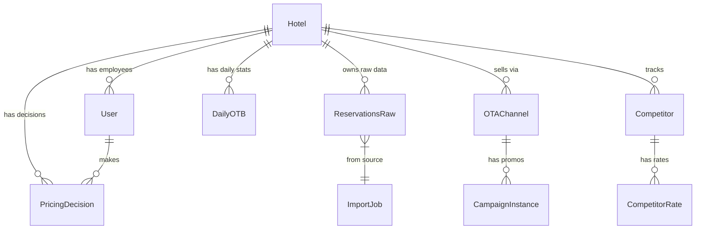

# Database Schema & Migrations

## Entity Relationship Diagram (ERD)

## Core Tables (Prisma Model Summary)

See `prisma/schema.prisma` for full definition.

### 1. `reservations_raw` (Fact Table)
- **Purpose**: Immutable log of booking states.
- **Key Fields**: `reservation_id`, `booking_date`, `status`, `revenue`, `arrival_date`, `departure_date`.
- **Uniqueness**: `[hotel_id, reservation_id, job_id]` (Versioned by Import Job).

### 2. `daily_otb` (Aggregated Fact)
- **Purpose**: Performance snapshot per stay date, as seen from a specific "As-Of" date.
- **Key Fields**: `as_of_date`, `stay_date`, `rooms_otb`, `revenue_otb`.
- **PK**: `[hotel_id, as_of_date, stay_date]`.

### 3. `pricing_decisions` (Audit Log)
- **Purpose**: Record of human/system pricing actions.
- **Key Fields**: `decision_id`, `stay_date`, `final_price`, `action` (ACCEPT/OVERRIDE).

### 4. `price_recommendations` (Transient)
- **Purpose**: Temporary storage for engine outputs before decision.
- **Key Fields**: `recommended_price`, `uplift_pct`, `explanation`.

## Migrations Strategy
- **ORM**: Prisma.
- **Versioning**: Timestamped migration files in `prisma/migrations`.
- **Apply**: `prisma migrate deploy` (Production) / `prisma migrate dev` (Development).
