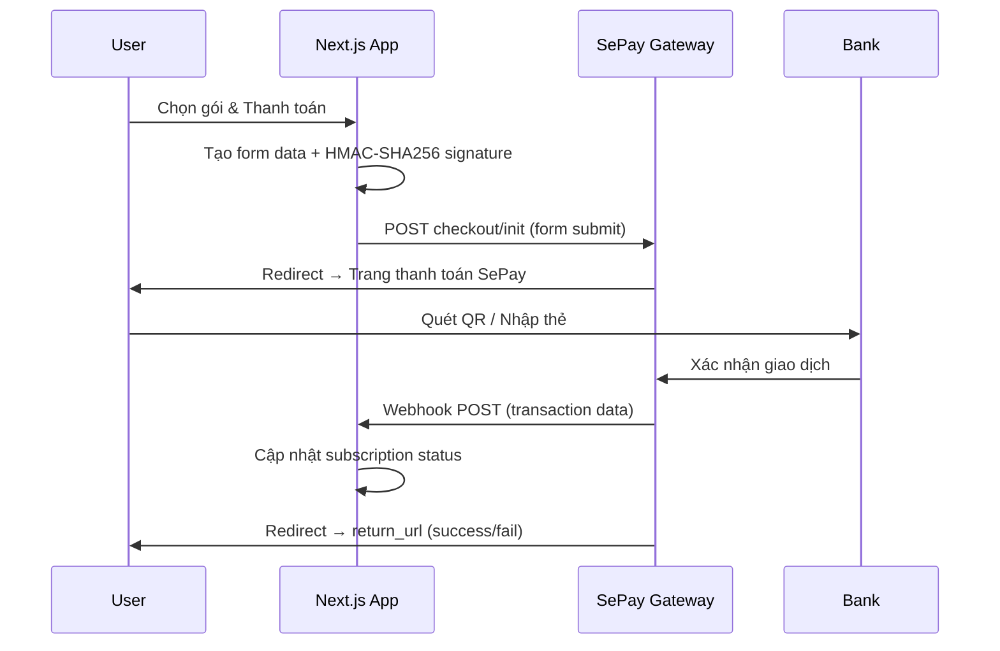
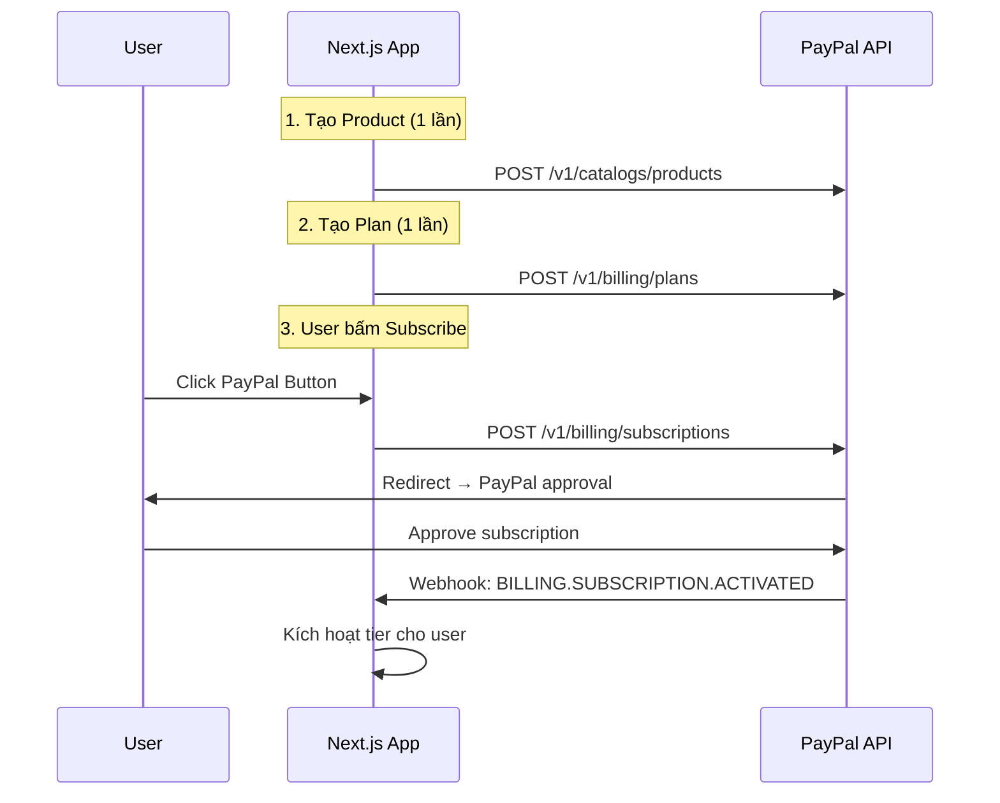

# 💡 BRIEF: Tích hợp Cổng Thanh Toán (SePay.vn + PayPal)

**Ngày tạo:** 2026-02-15
**Mục đích:** Nghiên cứu tài liệu API, phí, và khả năng tích hợp 2 cổng thanh toán cho hệ thống RMS

---

## 1. TỔNG QUAN HAI CỔNG THANH TOÁN

| Tiêu chí | **SePay.vn** 🇻🇳 | **PayPal** 🌍 |
|----------|-------------------|---------------|
| **Thị trường** | Việt Nam | Quốc tế (200+ quốc gia) |
| **Phương thức** | QR Banking, VietQR, Thẻ quốc tế | Ví PayPal, Thẻ quốc tế, Bank |
| **SDK** | `sepay-pg-node` (NodeJS) | `@paypal/react-paypal-js` (React) |
| **Auth** | Basic Auth (merchant_id + secret_key) | OAuth 2.0 (client_id + secret) |
| **Webhook** | ✅ API Key / OAuth2 | ✅ Webhook Event Notifications |
| **Sandbox** | ✅ `my.dev.sepay.vn` | ✅ `sandbox.paypal.com` |
| **Subscription** | ❌ Không native | ✅ REST Subscription API |
| **Docs** | `sepay.vn/docs` | `developer.paypal.com` |

---

## 2. SEPAY.VN — Chi tiết kỹ thuật

### 2.1. Biểu phí

| Phương thức | Phí |
|-------------|-----|
| **QR Banking / VietQR** | 200đ – 500đ / giao dịch |
| **QR VietQRPay / VietQRGlobal** | 0.3% / giao dịch |
| **Thẻ quốc tế (Visa/MC/JCB)** | 2.200đ + 2.2% / giao dịch |
| **Giao dịch tiền ra** | Miễn phí (từ 28/11/2024) |

> [!TIP]
> QR Banking chỉ 200-500đ/tx → cực kỳ phù hợp cho subscription VND giá rẻ

### 2.2. Luồng thanh toán (Payment Flow)



### 2.3. API Endpoints chính

| Endpoint | Method | Mô tả |
|----------|--------|-------|
| `checkout/init` | POST (form) | Khởi tạo giao dịch thanh toán |
| `/transactions` | GET | Query danh sách giao dịch |
| `/transactions/{id}` | GET | Chi tiết 1 giao dịch |
| `/webhook` (your endpoint) | POST | Nhận notification từ SePay |

### 2.4. Checkout Form Parameters

```typescript
// Tạo form data cho SePay checkout
const formData = {
    merchant_id: process.env.SEPAY_MERCHANT_ID,
    amount: 495000, // VND
    order_id: 'ORD-2025-001',
    order_description: 'Gói Superior - Tháng 3/2025',
    return_url: 'https://your-app.com/payment/success',
    cancel_url: 'https://your-app.com/payment/cancel',
    notify_url: 'https://your-app.com/api/webhooks/sepay', // Webhook
};

// Tạo HMAC-SHA256 signature
const signature = hmacSHA256(sortedParams, SEPAY_SECRET_KEY);
```

### 2.5. Webhook Payload (nhận từ SePay)

```json
{
    "id": 12345,
    "gateway": "MBBank",
    "transactionDate": "2025-02-15 10:30:00",
    "accountNumber": "0123456789",
    "code": "ORD-2025-001",
    "content": "ORD-2025-001 thanh toan goi Superior",
    "transferType": "in",
    "transferAmount": 495000,
    "accumulated": 5000000,
    "subAccount": null,
    "referenceCode": "FT25046XYZ"
}
```

### 2.6. Virtual Account (VA) — Auto-matching

SePay hỗ trợ **tài khoản ảo** cho mỗi order:
- Mỗi đơn hàng được gán 1 VA riêng
- Khi khách chuyển khoản đúng VA → tự động match
- VA tự hủy sau khi thanh toán hoặc hết hạn
- **Rất phù hợp** cho subscription auto-renewal bằng chuyển khoản

### 2.7. NodeJS SDK

```bash
npm install github:sepay/sepay-pg-node
```

```typescript
import SePay from 'sepay-pg-node';

const client = new SePay({
    merchantId: process.env.SEPAY_MERCHANT_ID,
    secretKey: process.env.SEPAY_SECRET_KEY,
});

// Tạo checkout
const checkout = await client.createCheckout({
    amount: 495000,
    orderId: 'ORD-001',
    description: 'Gói Superior',
    returnUrl: '/payment/success',
    notifyUrl: '/api/webhooks/sepay',
});
```

### 2.8. Rate Limits

- **2 requests/giây** — vượt quá sẽ nhận HTTP 429
- Header `x-sepay-userapi-retry-after` cho biết thời gian chờ

---

## 3. PAYPAL — Chi tiết kỹ thuật

### 3.1. Biểu phí

| Loại | Phí |
|------|-----|
| **Domestic (Mỹ)** | 3.49% + $0.49 |
| **Cross-border** | 4.49% + $0.49 + 1.5% |
| **Currency conversion** | 3-4% markup |
| **Subscription recurring** | Tương tự checkout fee |

> [!WARNING]
> PayPal phí cao hơn SePay nhiều (4-5% vs 0.05%). Chỉ nên dùng cho khách quốc tế.

### 3.2. Subscription Flow (6 bước)



### 3.3. API Endpoints chính

| Endpoint | Method | Mô tả |
|----------|--------|-------|
| `/v1/catalogs/products` | POST | Tạo product (RMS subscription) |
| `/v1/billing/plans` | POST | Tạo billing plan (monthly/yearly) |
| `/v1/billing/subscriptions` | POST | Tạo subscription cho user |
| `/v1/billing/subscriptions/{id}` | GET | Kiểm tra trạng thái |
| `/v1/billing/subscriptions/{id}/cancel` | POST | Hủy subscription |

### 3.4. Next.js Integration

```bash
npm install @paypal/react-paypal-js
```

```tsx
// Client Component
import { PayPalScriptProvider, PayPalButtons } from '@paypal/react-paypal-js';

<PayPalScriptProvider options={{
    clientId: process.env.NEXT_PUBLIC_PAYPAL_CLIENT_ID!,
    vault: true,
    intent: 'subscription',
}}>
    <PayPalButtons
        createSubscription={(data, actions) => {
            return actions.subscription.create({
                plan_id: 'P-XXXXXX', // Plan ID từ PayPal
            });
        }}
        onApprove={async (data) => {
            // Gọi API backend để activate
            await fetch('/api/paypal/activate', {
                method: 'POST',
                body: JSON.stringify({
                    subscriptionId: data.subscriptionID,
                }),
            });
        }}
    />
</PayPalScriptProvider>
```

### 3.5. Server-side (API Route)

```typescript
// app/api/paypal/activate/route.ts
const PAYPAL_API = process.env.PAYPAL_API_URL; // sandbox or live
const auth = Buffer.from(
    `${process.env.PAYPAL_CLIENT_ID}:${process.env.PAYPAL_SECRET}`
).toString('base64');

// Verify subscription status
const res = await fetch(
    `${PAYPAL_API}/v1/billing/subscriptions/${subscriptionId}`,
    { headers: { Authorization: `Basic ${auth}` } }
);
const sub = await res.json();
if (sub.status === 'ACTIVE') {
    // → Upgrade user tier in DB
}
```

### 3.6. Webhook Events quan trọng

| Event | Khi nào |
|-------|---------|
| `BILLING.SUBSCRIPTION.ACTIVATED` | User vừa subscribe thành công |
| `BILLING.SUBSCRIPTION.CANCELLED` | User hủy subscription |
| `BILLING.SUBSCRIPTION.EXPIRED` | Subscription hết hạn |
| `BILLING.SUBSCRIPTION.SUSPENDED` | Thanh toán thất bại |
| `PAYMENT.SALE.COMPLETED` | Recurring payment thành công |

---

## 4. ĐỀ XUẤT KIẾN TRÚC TÍCH HỢP

### 4.1. Dual Gateway Strategy

```
Khách VN  → SePay (QR Banking) → 200-500đ/tx ✨ rẻ nhất
Khách QT  → PayPal             → 4.49%        ✨ tin cậy nhất
```

### 4.2. Database Schema (đề xuất)

```sql
-- Bảng subscription cho cả 2 gateway
CREATE TABLE subscriptions (
    id UUID PRIMARY KEY,
    user_id UUID REFERENCES users(id),
    hotel_id UUID REFERENCES hotels(hotel_id),
    tier TEXT NOT NULL,              -- 'BASIC', 'SUPERIOR', 'PREMIUM'
    gateway TEXT NOT NULL,           -- 'sepay' | 'paypal'
    gateway_subscription_id TEXT,    -- PayPal subscription ID hoặc SePay order ID
    status TEXT NOT NULL,            -- 'active', 'cancelled', 'expired', 'suspended'
    amount DECIMAL(12,0),           -- VND hoặc USD (cents)
    currency TEXT DEFAULT 'VND',
    current_period_start TIMESTAMPTZ,
    current_period_end TIMESTAMPTZ,
    created_at TIMESTAMPTZ DEFAULT NOW(),
    updated_at TIMESTAMPTZ DEFAULT NOW()
);

-- Bảng ghi lại từng giao dịch thanh toán
CREATE TABLE payment_transactions (
    id UUID PRIMARY KEY,
    subscription_id UUID REFERENCES subscriptions(id),
    gateway TEXT NOT NULL,
    gateway_transaction_id TEXT,
    amount DECIMAL(12,0),
    currency TEXT,
    status TEXT,                     -- 'completed', 'failed', 'refunded'
    raw_payload JSONB,              -- Webhook payload gốc
    created_at TIMESTAMPTZ DEFAULT NOW()
);
```

### 4.3. API Routes cần tạo

```
app/api/payments/
├── sepay/
│   ├── create-checkout/route.ts   — Tạo SePay checkout form
│   └── webhook/route.ts           — Nhận webhook từ SePay
├── paypal/
│   ├── create-subscription/route.ts — Tạo PayPal subscription
│   ├── activate/route.ts           — Verify & activate
│   └── webhook/route.ts            — Nhận webhook từ PayPal
├── status/route.ts                 — Check subscription status
└── cancel/route.ts                 — Cancel subscription
```

### 4.4. Environment Variables cần thêm

```env
# SePay
SEPAY_MERCHANT_ID=
SEPAY_SECRET_KEY=
SEPAY_WEBHOOK_API_KEY=
SEPAY_API_URL=https://my.sepay.vn   # hoặc my.dev.sepay.vn (sandbox)

# PayPal
PAYPAL_CLIENT_ID=
PAYPAL_SECRET=
PAYPAL_API_URL=https://api-m.sandbox.paypal.com  # sandbox
# PAYPAL_API_URL=https://api-m.paypal.com        # production
NEXT_PUBLIC_PAYPAL_CLIENT_ID=                     # cho client-side SDK
```

---

## 5. SO SÁNH VÀ KHUYẾN NGHỊ

### Phí so sánh (gói 495.000 VND/tháng)

| Gateway | Phí/giao dịch | Chi phí thực | % doanh thu |
|---------|--------------|-------------|-------------|
| **SePay QR** | 200-500đ | ~500đ | **0.1%** |
| **SePay VietQRPay** | 0.3% | 1.485đ | 0.3% |
| **SePay Visa/MC** | 2200đ + 2.2% | ~13.090đ | 2.6% |
| **PayPal (VN)** | ~4.49% | ~22.225đ | **4.5%** |

### Ưu tiên

1. **SePay QR Banking** — Cho khách VN thanh toán chuyển khoản (rẻ nhất)
2. **SePay Visa/MC** — Cho khách VN dùng thẻ quốc tế
3. **PayPal** — Cho khách quốc tế, hoặc khi cần subscription tự động

### Rủi ro

| Rủi ro | Mức độ | Giải pháp |
|--------|--------|-----------|
| SePay API rate limit (2 req/s) | 🟡 | Queue + retry logic |
| PayPal phí cao | 🟡 | Chỉ dùng cho khách QT |
| SePay không có native subscription | 🔴 | Tự build cron job renew |
| Webhook bị miss | 🟡 | Retry + manual reconciliation |
| SePay sandbox hạn chế | 🟡 | Liên hệ SePay kích hoạt |

---

## 6. BƯỚC TIẾP THEO

| # | Việc | Lệnh |
|---|------|------|
| 1️⃣ | Lên plan chi tiết các phase | `/plan` |
| 2️⃣ | Thiết kế DB schema + API | `/design` |
| 3️⃣ | Thiết kế UI trang Pricing/Checkout | `/visualize` |
| 4️⃣ | Code tích hợp | `/code` |
