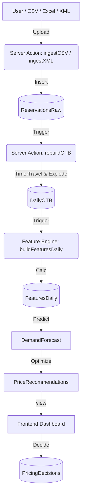

# System Architecture: RMS V02.0

## Overview
RMS V02.0 is a **SaaS Revenue Management System** with Room Band Pricing and Org-based multi-hotel tenancy. Core workflows: Import → Forecast → Recommend → Decide. Pricing scales by room band (R30/R80/R150/R300P).

## Tech Stack (Pivoted)
- **Frontend**: Next.js 16+ (App Router), Tailwind CSS, Shadcn/UI.
- **Backend**: Next.js Server Actions + API Routes.
- **Database**: PostgreSQL 16 (Supabase, region: Southeast Asia).
- **ORM**: Prisma.
- **Compute**: Vercel Serverless Functions (region: icn1/Seoul).
- **Auth**: NextAuth.js v5 + Google OAuth.

## Key Modules
1.  **Ingestion Engine**:
    *   Multi-format upload: CSV, Excel (.xlsx), XML (Crystal Reports).
    *   Cancellation XML with auto-bridge to reservations.
    *   Stores raw data in `ReservationsRaw` / `CancellationRaw` (Append-only).
    *   Tracks job status in `ImportJob` with file hashing for idempotency.
    *   Validates hotel_id before creating jobs (prevents FK errors).

2.  **Core RMS Engine (OTB Logic)**:
    *   **Time-Travel**: Reconstructs booking state at any past `as_of_date`.
    *   **Explode Nights**: Allocates revenue/rooms to specific `stay_dates`.
    *   **as_of_date**: Uses `loaded_at` (upload date), NOT `booking_date`.
    *   **Advisory Lock**: `pg_try_advisory_lock` prevents concurrent builds.
    *   Output: `DailyOTB` table.

3.  **RMS Brain & Pricing**:
    *   Feature Engine: Pickup rates (T-30/15/7/5/3), STLY, Pace, Supply.
    *   Build Features: `as_of_date` defaults to today (current date).
    *   Demand Forecast: Uses `max(as_of_date)` from `features_daily`.
    *   Pricing Engine: Rule-based Ladder Strategy.
    *   OTA Pricing: BAR→NET calculation with commission/promotions.
    *   **Unified Pricing (V01.9)**: Server-only engine (`engine.ts` + `service.ts`), `usePricingPreview` hook with AbortController + debounce. Client renders API response only.

4.  **Dashboard UI**:
    *   Visualizes OTB curves vs Last Year with date picker.
    *   Interactive Price Recommendation Table.
    *   Audit Log for Accept/Override actions.
    *   Cancellation Stats (Room-nights + Lost Revenue).

5.  **SaaS Infrastructure**:
    *   Multi-tenant with RBAC (super_admin/hotel_admin/manager/viewer).
    *   Org-based multi-hotel: Organization → Hotels. Subscription per org.
    *   Room Band Pricing: 4 bands (R30 ≤30 / R80 31-80 / R150 81-150 / R300P 151+).
    *   Auto-sync room_band when capacity changes (`deriveBand()` in Settings + Admin API).
    *   Subscription tiers (STANDARD/SUPERIOR/DELUXE/SUITE) with feature gating.
    *   Team invites: create + list + revoke. Short codes, usage tracking, expiry.
    *   Seat counting at HotelUser level (not OrgMember) for UI consistency.
    *   Onboarding wizard (4-step).
    *   Demo Hotel auto-assignment for new users.

## Data Pipeline
```
as_of_date tracking:
  Step 1: Upload CSV/Excel/XML → reservations_raw
  Step 2: Build OTB (as_of_date = loaded_at) → daily_otb
  Step 3: Build Features (as_of_date = today) → features_daily
  Step 4: Run Forecast (as_of_date = max from features_daily) → demand_forecast
  Step 5: Pricing Engine → recommended_price (on-the-fly)
```



## Data Deletion
- **Delete by Month**: Removes reservations + cancellations for a specific month.
- **Include OTB**: Optional checkbox to also clear `DailyOTB` + `FeaturesDaily`.
- **Hotel-scoped**: All delete operations filter by `hotel_id`.
