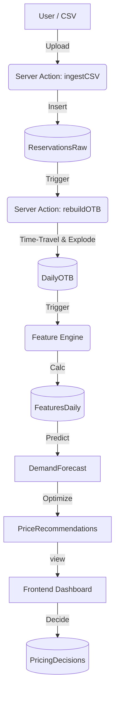

# System Architecture: RMS V01 (MVP)

## Overview
RMS V01 is a **SaaS-ready Revenue Management System** designed for 14-day pilots. It focuses on core pricing workflows: Import -> Forecast -> Recommend -> Decide.

## Tech Stack (Pivoted)
- **Frontend**: Next.js 14+ (App Router), Tailwind CSS, Shadcn/UI.
- **Backend**: Next.js Server Actions (No separate API server).
- **Database**: PostgreSQL 16 (Managed via Docker/Supabase).
- **ORM**: Prisma.
- **Compute**: Vercel Serverless Functions / Edge.

## Key Modules
1.  **Ingestion Engine**:
    *   Stream-parses CSV files (Papaparse).
    *   Stores raw data in `ReservationsRaw` (Append-only).
    *   Tracks job status in `ImportJob`.

2.  **Core RMS Engine (OTB Logic)**:
    *   **Time-Travel**: Reconstructs booking state at any past `as_of_date`.
    *   **Explode Nights**: Allocates revenue/rooms to specific `stay_dates`.
    *   Output: `DailyOTB` table.

3.  **RMS Brain & Pricing**:
    *   Feature Engine (Pickup, Pace, Supply)
    *   Demand Forecast (Heuristic)
    *   Pricing Engine (Rule-based Ladder)

4.  **Dashboard UI**:
    *   Visualizes OTB curves vs Last Year.
    *   Interactive Price Recommendation Table.
    *   Audit Log for Accept/Override actions.

## Data Flow

