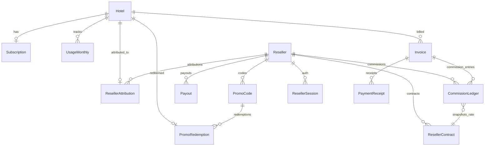

# SPEC: PLG Growth + Reseller + Auto Monetization

**Source**: [BRIEF-plg-growth.md](file:///c:/Apps/Antigravity/revenue-management-system/docs/BRIEF-plg-growth.md)
**Plan**: [plan.md](file:///c:/Apps/Antigravity/revenue-management-system/plans/260213-1042-plg-reseller/plan.md)
**Date**: 2026-02-13 | **Rev**: 3 (post-review)

---

## 0. Glossary & Invariants

### Invariants (rules that MUST never break)

| # | Rule | Enforcement |
|---|------|-------------|
| I1 | One hotel = one tenant | `requireHotelAccess(userId, hotelId)` on every hotel-scoped route |
| I2 | One hotel = at most one active promo | `Hotel.active_promo_code_id` + `SELECT FOR UPDATE` row-lock |
| I3 | CommissionLedger is append-only | No UPDATE on amount/rate; reversal = new row with negative amount |
| I4 | Best discount wins, no stacking | `bestDiscountWins()` resolves single winner; attribution still attaches |
| I5 | Commission only on paid invoices | `Invoice.status = PAID` required; past_due = 0 commission |
| I6 | Attribution history never deleted | Close via `effective_to` + `ended_reason`, never DELETE |
| I7 | Commission idempotent per invoice | `@@unique([invoice_id, contract_id, rule_version, entry_type])` |
| I8 | Quota enforced inline, not by cron | Billable events increment UsageMonthly in same transaction |
| I9 | Export is quota, not feature flag | All plans CAN export; limits differ by tier |

### Glossary

| Term | Definition |
|------|-----------|
| **Net collected** | Tiền thực thu, sau discount/coupon, sau refund/chargeback, không VAT |
| **Attribution** | Link hotel → reseller (immutable history, closeable) |
| **Clawback** | Reversal of commission due to refund/chargeback (negative ledger entry) |
| **Grace period** | 60d after subscription lapse; attribution survives within grace |
| **Soft gate** | Feature visible but output/actions blocked → upgrade CTA |
| **Hard gate** | Feature completely blocked (e.g., multi-hotel) |
| **Inline increment** | UsageMonthly counter updated atomically in same tx as billable action |

---

## 1. Executive Summary

Transform RMS from "good tool, no self-sell" into a PLG engine with:
- Entitlements + gating → right friction at the right time
- Usage metering + upgrade nudges → automated conversion
- Reseller attribution + commission ledger → partner sales channel
- Promo codes + discount rules → automated offers

---

## 2. Data Architecture

### ERD



### Models by Sprint

| Sprint | New Models | Modified Models |
|--------|-----------|----------------|
| S1 | UsageMonthly | Subscription (+trial fields), Hotel (+active_promo_code_id), ProductEvent (+session_id) |
| S2 | Reseller, ResellerAttribution, ResellerContract, PromoCode, PromoRedemption | — |
| S3 | Invoice, PaymentReceipt, CommissionLedger, Payout, ResellerSession | — |

### Migration Strategy
- **Dev**: `npx prisma db push` (fast iteration)
- **Staging/Prod**: `npx prisma migrate dev` → `npx prisma migrate deploy` (tracked files)

---

## 3. Service Layer

### Module Layout
```
lib/plg/          → entitlements, guard, trial, usage, events, plan-config, types
lib/reseller/     → reseller, attribution, contracts, reseller-auth
lib/promo/        → promo (includes bestDiscountWins)
lib/commission/   → commission
lib/payout/       → payout
lib/audit/        → audit
lib/shared/       → errors, authz (RBAC), idempotency
```

### Key Service APIs

| Service | Function | Returns |
|---------|----------|---------|
| `entitlements` | `getEntitlements(hotelId)` | plan, status, limits, features, isTrialExpired |
| `guard` | `requireFeature(hotelId, key)` | void or throws PaywallError |
| `guard` | `requireQuota(hotelId, key)` | void or throws QuotaExceededError |
| `usage` | `incrementUsage(hotelId, field)` | atomic upsert UsageMonthly (inline) |
| `events` | `logSessionEvent(userId, hotelId, type, sessionId)` | deduped ProductEvent |
| `trial` | `checkTrialBonus(hotelId)` | { conditions[], bonusGranted } |
| `attribution` | `attributeHotel(hotelId, resellerId, method)` | ResellerAttribution |
| `promo` | `redeemCode(code, hotelId)` | transactional: lock + redeem + attribute |
| `commission` | `calculateCommission(invoiceId)` | idempotent CommissionLedger entry |

### Quota Enforcement Architecture
```
Route: POST /api/data/import
  → requireHotelAccess(userId, hotelId)       // RBAC
  → requireQuota(hotelId, 'imports')           // check UsageMonthly < limit
  → ... do import ...
  → incrementUsage(hotelId, 'imports')         // atomic upsert (same tx)
  → logEvent(userId, hotelId, 'import_success')

Cron (daily 2AM): reconciliation only
  → recount events → fix UsageMonthly if drifted
```

---

## 4. API Contract

### Route Boundaries

| Scope | Prefix | Guard |
|-------|--------|-------|
| Hotel-tenant | `/api/entitlements`, `/api/promo/*` | `requireHotelAccess()` |
| Admin | `/api/admin/*` | `requireRole('admin')` |
| Reseller portal | `/api/reseller/*` | `requireResellerSession` (custom token, NOT NextAuth) |
| Cron | `/api/cron/*` | `CRON_SECRET` header |

### Error Shapes

```typescript
// 403 — Feature blocked by plan
interface PaywallError {
  error: 'PAYWALL';
  featureKey: FeatureKey;
  currentPlan: PlanTier;
  requiredPlan: PlanTier;
  reason_codes: string[];
}

// 429 — Quota exceeded
interface QuotaExceededError {
  error: 'QUOTA_EXCEEDED';
  quotaKey: string;
  current: number;
  limit: number;
  reason_codes: string[];
}
```

---

## 5. Reason Codes Catalog

| Code | Trigger | Recommend |
|------|---------|-----------|
| `IMPORT_LIMIT_HIT` | Import count ≥ max_imports_month | → SUPERIOR |
| `EXPORT_LIMIT_HIT` | Export count ≥ max_exports_day | → SUPERIOR |
| `PLAYBOOK_LOCKED` | Open Playbook without DELUXE+ | → DELUXE |
| `ANALYTICS_PREVIEW` | Open Analytics without DELUXE+ | → DELUXE |
| `MULTI_HOTEL_LOCKED` | Attempt to create 2nd hotel | → SUITE |
| `RATE_SHOPPER_NO_CREDITS` | Rate Shopper without credits | → SUITE |
| `SCENARIO_PERSIST_PAYWALL` | Save/Pin scenario on Starter | → SUPERIOR |
| `INVITE_SEAT_LIMIT` | Invite user beyond max_users | → next tier |
| `BULK_PRICING_LOCKED` | Bulk pricing without SUPERIOR+ | → SUPERIOR |

---

## 6. Feature vs Quota Disambiguation

> **Rule**: If a capability has a **numeric limit** that varies by plan, it's a **quota**. If it's **on/off** per plan, it's a **feature flag**.

| Capability | Type | STANDARD | SUPERIOR | DELUXE | SUITE |
|-----------|------|----------|----------|--------|-------|
| Export matrix | **Quota** | 1/day | 10/day | ∞ | ∞ |
| Import data | **Quota** | 3/month | 15/month | 50/month | ∞ |
| Users/seats | **Quota** | 1 | 3 | 10 | ∞ |
| Max scenarios | **Quota** | 3 | ∞ | ∞ | ∞ |
| Bulk pricing | **Feature** | ❌ | ✅ | ✅ | ✅ |
| Playbook | **Feature** | Preview | Preview | ✅ | ✅ |
| Multi-hotel | **Feature** | ❌ | ❌ | ❌ | ✅ |
| Persist scenarios | **Feature** | ❌ | ✅ | ✅ | ✅ |

---

## 7. Business Rules

1. **Scenarios**: Starter = session-based (Zustand, max 3, no persist)
2. **Trial**: 7 + 7 bonus (2/3: IMPORT ≥1, DASHBOARD_SESSION ≥3, PRICING_SESSION ≥2; anti-abuse cap 3 sessions/day/type)
3. **Gating**: OTA Calculator free; Bulk/Playbook gated; Multi-hotel hard-gated
4. **Attribution**: Lifetime + active condition + 60d grace
5. **Commission**: 20% flat net collected, append-only ledger, idempotent per invoice
6. **Discount**: Best discount wins, no stacking, tie-breaker: highest % → CAMPAIGN > GLOBAL > RESELLER → oldest
7. **Promo**: 1 hotel = 1 active code, transactional redemption with row-lock
8. **Invoice**: Billing Core (Invoice + PaymentReceipt) = source of truth for commission
9. **Reseller Auth**: Custom magic-link + token table, separate from hotel NextAuth

---

## 8. Build Checklist

- [ ] Phase 01: Schema migration S1 (UsageMonthly, trial fields, session_id)
- [ ] Phase 02: Entitlements service (`lib/plg/entitlements.ts`)
- [ ] Phase 03: Guard + gating (`lib/plg/guard.ts` + `lib/shared/authz.ts`)
- [ ] Phase 04: Event logging + inline quota increment + reconciliation cron
- [ ] Phase 05: PLG UI components
- [ ] Phase 06: Trial policy (7+7, anti-abuse cap)
- [ ] Phase 07: Schema migration S2 + Reseller + attribution
- [ ] Phase 08: PromoCode + redemption (row-lock + transactional)
- [ ] Phase 09: Schema migration S3 + Billing Core + Commission ledger
- [ ] Phase 10: Reseller portal (custom auth)
- [ ] Phase 11: Payout + audit + PDF
- [ ] Phase 12: Admin dashboard (internal CRM)
